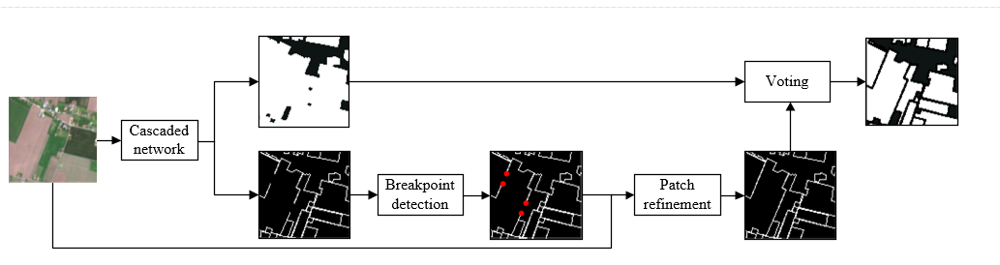

# Introduction

This repo is the official implementation of our paper: SLP: cropland parcel extraction based on surface, line and point.  Our paper hasn't been accepted yet so we release the part of the code. The prediction process is shown in figure below.

- 

# Data and checkpoint

Google cloud: https://drive.google.com/drive/folders/1f1jZwUCS4892bkne7Ob1iWmcFhj8aDIZ?usp=sharing

# How to use

1. To obtain the cropland parcel(without using patch refinement)

   ```bash
   python main.py --img ${image_path} --weights ${weights_path} --shp ${the_path_of_output_in_shapefile}
   ```

   

2. The next step is repair the break line

   ```bash
   python PatchRefinement.py --lineDN ${lineDN_path} --img ${image_path} --weights ${weights_path}
   ```

   

3. In final, merge the results of the two steps.

   ```bash
   python postprocess.py --img ${image_path} --shp ${the_path_of_output_in_shapefile}
   ```

PS: We will release the training code if our paper is accepted in the future.

